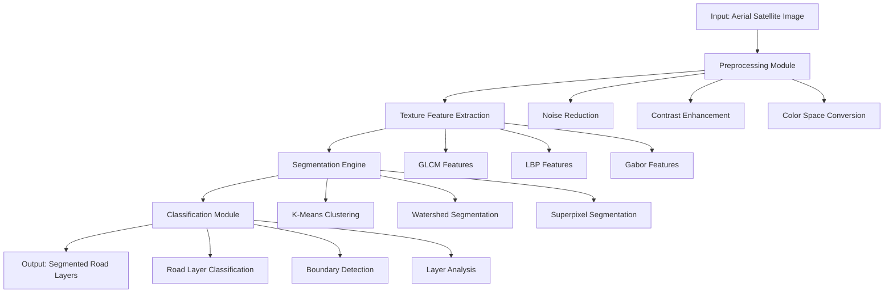

# Automated Road Surface Layers Analysis using Texture-Based Image Segmentation

## Project Overview

This project implements an automated system for analyzing road surface layers from Google Earth Pro aerial satellite images using texture-based image segmentation techniques. The system will identify and classify different road surface materials (asphalt, concrete, gravel, dirt) based on their texture characteristics.

> [!IMPORTANT]
> This implementation uses **Python** instead of MATLAB, leveraging CUDA GPU acceleration for improved performance. All image processing techniques are derived from CSC566 course materials.

---

## Proposed Changes

### Project Architecture



---

### Core Module Structure

#### [NEW] [src/](file:///g:/Developement-ANTIGRAVITY/CSC566-Mini-Project/src/)
Project source code directory.

#### [NEW] [config.py](file:///g:/Developement-ANTIGRAVITY/CSC566-Mini-Project/src/config.py)
- Global configuration and constants
- Path definitions
- Processing parameters

#### [NEW] [preprocessing.py](file:///g:/Developement-ANTIGRAVITY/CSC566-Mini-Project/src/preprocessing.py)
**Noise Reduction:**
- Gaussian filtering
- Median filtering (salt-and-pepper noise)
- Bilateral filtering (edge-preserving)

**Contrast Enhancement:**
- Histogram equalization
- CLAHE (Contrast Limited Adaptive Histogram Equalization)
- Gamma correction

**Color Space Conversion:**
- RGB → Grayscale
- RGB → HSV
- RGB → Lab

---

#### [NEW] [texture_features.py](file:///g:/Developement-ANTIGRAVITY/CSC566-Mini-Project/src/texture_features.py)
**GLCM (Gray-Level Co-occurrence Matrix):**
```python
def extract_glcm_features(image, distances=[1, 2, 3], angles=[0, 45, 90, 135]):
    """
    Extract texture features using GLCM.
    Returns: Contrast, Energy, Homogeneity, Correlation, Entropy
    """
```

**LBP (Local Binary Patterns):**
```python
def extract_lbp_features(image, radius=3, n_points=24):
    """
    Extract rotation-invariant LBP texture descriptors.
    Returns: LBP histogram features
    """
```

**Gabor Filters:**
```python
def extract_gabor_features(image, frequencies, orientations):
    """
    Multi-scale, multi-orientation texture analysis.
    Returns: Gabor response features
    """
```

**Statistical Features:**
```python
def extract_statistical_features(image):
    """
    Mean, Standard Deviation, Smoothness, Skewness, Kurtosis
    """
```

---

#### [NEW] [segmentation.py](file:///g:/Developement-ANTIGRAVITY/CSC566-Mini-Project/src/segmentation.py)
**Clustering Methods:**
- K-Means segmentation (RGB space)
- K-Means with texture features
- Fuzzy C-Means

**Edge-Based Methods:**
- Sobel edge detection
- Canny edge detection
- Prewitt operators

**Region-Based Methods:**
- Watershed segmentation
- Region growing
- SLIC Superpixels

**Thresholding Methods:**
- Otsu's method
- Adaptive thresholding
- Multi-level thresholding

---

#### [NEW] [classification.py](file:///g:/Developement-ANTIGRAVITY/CSC566-Mini-Project/src/classification.py)
**Road Surface Classifier:**
```python
class RoadSurfaceClassifier:
    """
    Classifies road surface types based on texture features.
    Classes: Asphalt, Concrete, Gravel, Dirt/Unpaved
    """
    
    def train(self, features, labels):
        """Train classifier with labeled texture features."""
    
    def predict(self, features):
        """Predict road surface type."""
    
    def evaluate(self, test_features, test_labels):
        """Compute accuracy metrics."""
```

---

#### [NEW] [morphology.py](file:///g:/Developement-ANTIGRAVITY/CSC566-Mini-Project/src/morphology.py)
**Post-Processing Operations:**
- Erosion / Dilation
- Opening / Closing
- Hole filling
- Small region removal
- Connected component analysis

---

#### [NEW] [descriptors.py](file:///g:/Developement-ANTIGRAVITY/CSC566-Mini-Project/src/descriptors.py)
**Boundary Representations:**
- Chain code generation
- Boundary tracing
- Fourier descriptors

**Region Descriptors:**
- Area, Perimeter
- Compactness, Eccentricity
- Euler number
- Bounding box

---

#### [NEW] [visualization.py](file:///g:/Developement-ANTIGRAVITY/CSC566-Mini-Project/src/visualization.py)
- Image display utilities
- Histogram plotting
- Segmentation overlay
- Feature heatmaps
- Results comparison views

---

### GUI Application

#### [NEW] [gui/main_window.py](file:///g:/Developement-ANTIGRAVITY/CSC566-Mini-Project/gui/main_window.py)
**PyQt5-based GUI with:**
- Image loading panel (drag-and-drop support)
- Processing controls (sliders, checkboxes)
- Real-time preview
- Results panel with statistics
- Export functionality

**Layout:**
```
┌─────────────────────────────────────────────────────────────┐
│  Menu Bar: File | Edit | Processing | View | Help           │
├─────────────────────────────────────────────────────────────┤
│ ┌─────────────────┐  ┌─────────────────────────────────────┐│
│ │  Input Image    │  │  Processed Result                   ││
│ │                 │  │                                     ││
│ │                 │  │                                     ││
│ │                 │  │                                     ││
│ └─────────────────┘  └─────────────────────────────────────┘│
├─────────────────────────────────────────────────────────────┤
│ Processing Pipeline: [Preprocess] → [Features] → [Segment]  │
├─────────────────────────────────────────────────────────────┤
│ Parameters Panel:                                           │
│  ├─ Preprocessing: [Noise Filter ▼] [Kernel: 3x3]           │
│  ├─ Features: [☑ GLCM] [☑ LBP] [☐ Gabor]                  │
│  ├─ Segmentation: [K-Means ▼] [K: 4]                        │
│  └─ [Process] [Reset] [Export]                              │
├─────────────────────────────────────────────────────────────┤
│ Results: Area Coverage | Layer Statistics | Export Report   │
└─────────────────────────────────────────────────────────────┘
```

---

### Test Suite Structure

#### [NEW] [tests/](file:///g:/Developement-ANTIGRAVITY/CSC566-Mini-Project/tests/)

```
tests/
├── __init__.py
├── conftest.py                 # Pytest fixtures
├── test_preprocessing.py       # Unit tests for preprocessing
├── test_texture_features.py    # Unit tests for texture extraction
├── test_segmentation.py        # Unit tests for segmentation
├── test_classification.py      # Unit tests for classification
├── test_morphology.py          # Unit tests for morphological ops
├── test_descriptors.py         # Unit tests for descriptors
├── test_integration.py         # Integration tests
├── test_performance.py         # Performance benchmarks
└── test_gui.py                 # GUI component tests
```

---

## Verification Plan

### Phase 1: Automated Unit Tests

**Command to run all tests:**
```bash
cd g:\Developement-ANTIGRAVITY\CSC566-Mini-Project
pytest tests/ -v --cov=src --cov-report=html
```

**Individual test modules:**
```bash
# Test preprocessing module
pytest tests/test_preprocessing.py -v

# Test texture feature extraction
pytest tests/test_texture_features.py -v

# Test segmentation algorithms
pytest tests/test_segmentation.py -v

# Test classification module
pytest tests/test_classification.py -v
```

### Phase 2: Integration Tests

**Full pipeline test:**
```bash
pytest tests/test_integration.py -v
```

This will test:
1. Image loading → Preprocessing → Feature extraction → Segmentation → Classification
2. Input/output format compatibility
3. Error handling for edge cases

### Phase 3: Performance Benchmarks

**GPU acceleration verification:**
```bash
pytest tests/test_performance.py -v --benchmark-enable
```

Tests will verify:
- CUDA availability and utilization
- Processing speed comparison (CPU vs GPU)
- Memory usage profiling

### Phase 4: Visual Validation

**Generate visual validation report:**
```bash
python -m src.validation --input data/test_images/ --output results/validation/
```

This will generate:
- Side-by-side comparison images
- Segmentation overlays
- Feature heatmaps
- Processing statistics

### Phase 5: Accuracy Metrics

**Compute segmentation accuracy (requires ground truth):**
```bash
python -m src.evaluate --predictions results/ --ground-truth data/ground_truth/
```

Metrics computed:
- IoU (Intersection over Union)
- Dice coefficient
- Pixel accuracy
- Confusion matrix

### Phase 6: Six-Pass Quality Review

| Pass | Focus Area | Verification Method |
|------|-----------|---------------------|
| 1 | Code Correctness | `pytest tests/ -v` + static analysis with `flake8` |
| 2 | Logic Flow | Manual code review + flowchart validation |
| 3 | Architecture | Module dependency check + design pattern review |
| 4 | Test Coverage | `pytest --cov=src --cov-fail-under=80` |
| 5 | Edge Cases | Boundary condition tests + error handling verification |
| 6 | Performance | Benchmark tests + profiling with `cProfile` |

### Manual Testing Checklist (GUI)

1. **Image Loading:**
   - [ ] Load PNG/JPG/TIFF images successfully
   - [ ] Handle corrupt/invalid images gracefully
   - [ ] Display image dimensions and info

2. **Processing Pipeline:**
   - [ ] Apply preprocessing with visible results
   - [ ] Adjust parameters and see real-time preview
   - [ ] Switch between segmentation methods

3. **Results:**
   - [ ] View segmented layers with color coding
   - [ ] Export results as images and reports
   - [ ] View statistics (area coverage, layer counts)

---

## Dependencies

```python
# requirements.txt
numpy>=1.24.0
opencv-python>=4.8.0
scikit-image>=0.21.0
scikit-learn>=1.3.0
scipy>=1.11.0
matplotlib>=3.7.0
PyQt5>=5.15.0
torch>=2.0.0  # For CUDA support
pytest>=7.4.0
pytest-cov>=4.1.0
pytest-benchmark>=4.0.0
tqdm>=4.66.0
pillow>=10.0.0
```

---

## Project Deliverables

1. **Source Code**: Python modules with comprehensive comments
2. **GUI Application**: Standalone executable
3. **Test Suite**: Automated tests with >80% coverage
4. **Report**: Following project format requirements
5. **Paper**: Academic paper with abstract, methodology, results
6. **Presentation**: 5-minute demo with GUI showcase
