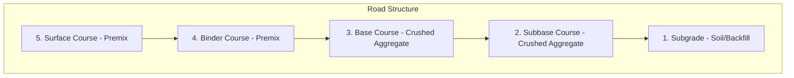
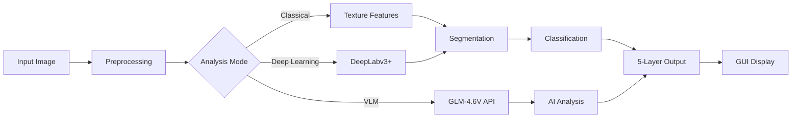

# Automated Road Surface Layers Analysis using Texture-Based Image Segmentation

## Project Overview

Automated system for analyzing **5 distinct road construction layers** from Google Earth Pro aerial satellite images using texture-based image segmentation, with optional deep learning (DeepLabv3+) and Vision Language Model (GLM-4.6V) integration.

> [!IMPORTANT]
> - **Language**: Python (with CUDA GPU acceleration)
> - **Dataset**: Google Earth Pro aerial satellite images (5 folders per layer type)
> - **Deliverables**: Presentation (5%), Report (15%), Paper (10%)

---

## Road Layer Classification System

| Layer # | Layer Name | Material | Visual Characteristics |
|---------|------------|----------|------------------------|
| 1 | **Subgrade** | In-site soil/backfill | Earth tones, irregular texture, visible soil patterns |
| 2 | **Subbase Course** | Crushed aggregate | Coarse granular texture, varied stone sizes |
| 3 | **Base Course** | Crushed aggregate | Finer aggregate, more uniform than subbase |
| 4 | **Binder Course** | Premix (asphalt) | Dark, semi-smooth texture with aggregate visible |
| 5 | **Surface/Wearing Course** | Premix (asphalt) | Smooth, uniform dark surface, fine texture |



---

## System Architecture



---

## Proposed Changes

### Project Structure

```
CSC566-Mini-Project/
├── .venv/                      # Python virtual environment
├── .gitignore                  # Git ignore file
├── requirements.txt            # Dependencies
├── README.md                   # Project documentation
│
├── data/
│   ├── subgrade/               # Layer 1 images
│   ├── subbase/                # Layer 2 images
│   ├── base_course/            # Layer 3 images
│   ├── binder_course/          # Layer 4 images
│   └── surface_course/         # Layer 5 images
│
├── src/
│   ├── __init__.py
│   ├── config.py               # Configuration & constants
│   ├── preprocessing.py        # Noise reduction, contrast, color space
│   ├── texture_features.py     # GLCM, LBP, Gabor, statistics
│   ├── segmentation.py         # K-Means, Watershed, Superpixels
│   ├── classification.py       # 5-layer classifier
│   ├── morphology.py           # Post-processing operations
│   ├── descriptors.py          # Boundary/region descriptors
│   ├── deep_learning.py        # DeepLabv3+ integration
│   ├── vlm_analyzer.py         # GLM-4.6V VLM integration
│   └── visualization.py        # Display utilities
│
├── gui/
│   ├── __init__.py
│   ├── main_window.py          # Main PyQt5 application
│   ├── image_panel.py          # Image display widget
│   ├── controls_panel.py       # Processing controls
│   └── results_panel.py        # Results & statistics
│
├── tests/
│   ├── conftest.py             # Pytest fixtures
│   ├── test_preprocessing.py
│   ├── test_texture_features.py
│   ├── test_segmentation.py
│   ├── test_classification.py
│   ├── test_deep_learning.py
│   ├── test_vlm_analyzer.py
│   ├── test_integration.py
│   └── test_performance.py
│
└── results/                    # Output directory
```

---

### Core Modules

#### [NEW] [config.py](file:///g:/Developement-ANTIGRAVITY/CSC566-Mini-Project/src/config.py)

```python
# Road layer definitions
ROAD_LAYERS = {
    1: {"name": "Subgrade", "material": "In-site soil/backfill"},
    2: {"name": "Subbase Course", "material": "Crushed aggregate"},
    3: {"name": "Base Course", "material": "Crushed aggregate"},
    4: {"name": "Binder Course", "material": "Premix"},
    5: {"name": "Surface Course", "material": "Premix"}
}

# ZenMux API Configuration (VLM)
ZENMUX_API_KEY = "sk-ai-v1-..."  # Stored in .env
ZENMUX_BASE_URL = "https://zenmux.ai/api/v1"
VLM_MODEL = "z-ai/glm-4.6v"
```

---

#### [NEW] [vlm_analyzer.py](file:///g:/Developement-ANTIGRAVITY/CSC566-Mini-Project/src/vlm_analyzer.py)

**Vision Language Model Integration via ZenMux API:**

```python
class VLMAnalyzer:
    """GLM-4.6V integration for intelligent road layer analysis."""
    
    def __init__(self, api_key: str):
        self.api_key = api_key
        self.base_url = "https://zenmux.ai/api/v1/chat/completions"
        self.model = "z-ai/glm-4.6v"
    
    def analyze_road_layer(self, image_path: str) -> dict:
        """
        Analyze image using GLM-4.6V to identify road construction layer.
        Returns: layer prediction, confidence, material description
        """
    
    def get_detailed_analysis(self, image_path: str) -> str:
        """
        Get comprehensive analysis including:
        - Layer type identification
        - Material composition estimate
        - Surface condition assessment
        - Construction stage recommendation
        """
    
    def compare_layers(self, image_paths: list) -> str:
        """Compare multiple road layer images."""
```

**Prompt Engineering for Road Analysis:**
```python
ROAD_ANALYSIS_PROMPT = """
Analyze this aerial satellite image of a road construction site.
Identify which of the 5 road construction layers is shown:
1. Subgrade (in-site soil/backfill) - Earth/soil
2. Subbase Course (crushed aggregate) - Coarse stones
3. Base Course (crushed aggregate) - Finer aggregate
4. Binder Course (premix) - Dark asphalt with visible aggregate
5. Surface Course (premix) - Smooth asphalt finish

Provide:
- Layer number and name
- Confidence level (0-100%)
- Material description observed
- Texture characteristics
"""
```

---

#### [NEW] [deep_learning.py](file:///g:/Developement-ANTIGRAVITY/CSC566-Mini-Project/src/deep_learning.py)

**DeepLabv3+ Integration:**

```python
class DeepLabSegmenter:
    """DeepLabv3+ semantic segmentation for road layers."""
    
    def __init__(self, model_path: str = None, use_cuda: bool = True):
        self.device = "cuda" if use_cuda and torch.cuda.is_available() else "cpu"
        self.model = self._load_model(model_path)
    
    def segment(self, image: np.ndarray) -> np.ndarray:
        """Perform semantic segmentation."""
    
    def train(self, train_loader, val_loader, epochs: int = 50):
        """Fine-tune model on road layer dataset."""
    
    def evaluate(self, test_loader) -> dict:
        """Compute IoU, accuracy, confusion matrix."""
```

---

### GUI Design

```
┌─────────────────────────────────────────────────────────────────────────┐
│  Road Surface Layer Analyzer                               [—] [□] [X]  │
├─────────────────────────────────────────────────────────────────────────┤
│ File   Edit   Processing   Analysis   Help                              │
├─────────────────────────────────────────────────────────────────────────┤
│ ┌───────────────────────┐  ┌─────────────────────────────────────────┐  │
│ │                       │  │                                         │  │
│ │    Original Image     │  │         Segmented Result                │  │
│ │                       │  │    (Color-coded by layer)               │  │
│ │                       │  │                                         │  │
│ └───────────────────────┘  └─────────────────────────────────────────┘  │
├─────────────────────────────────────────────────────────────────────────┤
│ Analysis Mode:                                                          │
│  ○ Classical (Texture-based)  ○ Deep Learning (DeepLabv3+)              │
│  ○ VLM Analysis (GLM-4.6V)    ○ Hybrid (Classical + AI)                 │
├─────────────────────────────────────────────────────────────────────────┤
│ Layer Legend:  ■ Subgrade  ■ Subbase  ■ Base  ■ Binder  ■ Surface       │
├─────────────────────────────────────────────────────────────────────────┤
│ Results:                                                                │
│ ┌─────────────────────────────────────────────────────────────────────┐ │
│ │ Detected Layer: Surface Course (Wearing Course)                     │ │
│ │ Confidence: 94.2%                                                   │ │
│ │ Material: Premix asphalt with fine aggregate                        │ │
│ │ Texture: Smooth, uniform, low roughness                             │ │
│ │ GLCM Contrast: 0.23 | Energy: 0.78 | Homogeneity: 0.92              │ │
│ └─────────────────────────────────────────────────────────────────────┘ │
├─────────────────────────────────────────────────────────────────────────┤
│ [📂 Load Image]  [▶ Analyze]  [💾 Export]  [📊 Batch Process]         │
└─────────────────────────────────────────────────────────────────────────┘
```

---

### Dependencies

```python
# requirements.txt
numpy>=1.24.0
opencv-python>=4.8.0
scikit-image>=0.21.0
scikit-learn>=1.3.0
scipy>=1.11.0
matplotlib>=3.7.0
PyQt5>=5.15.0
torch>=2.0.0
torchvision>=0.15.0
segmentation-models-pytorch>=0.3.0  # For DeepLabv3+
requests>=2.31.0                     # For VLM API calls
python-dotenv>=1.0.0                 # For .env file support
pytest>=7.4.0
pytest-cov>=4.1.0
pytest-benchmark>=4.0.0
tqdm>=4.66.0
pillow>=10.0.0
```

---

## Verification Plan

### Automated Tests

```bash
# Run all tests with coverage
pytest tests/ -v --cov=src --cov-report=html --cov-fail-under=80

# Test specific modules
pytest tests/test_vlm_analyzer.py -v      # VLM integration
pytest tests/test_deep_learning.py -v     # DeepLabv3+
pytest tests/test_classification.py -v    # 5-layer classifier
```

### 6-Pass Quality Review

| Pass | Focus | Method |
|------|-------|--------|
| 1 | Code Correctness | `pytest` + `flake8` static analysis |
| 2 | Logic Flow | Manual review + architecture diagrams |
| 3 | Architecture | Dependency check + SOLID principles |
| 4 | Test Coverage | `--cov-fail-under=80` enforcement |
| 5 | Edge Cases | Boundary tests + error handling |
| 6 | Performance | GPU benchmarks + profiling |

### Accuracy Metrics

- **Classification Accuracy**: Per-layer and overall
- **IoU (Intersection over Union)**: Segmentation quality
- **Confusion Matrix**: 5x5 layer classification
- **VLM Validation**: Compare VLM predictions vs ground truth

---

## Security Notes

> [!CAUTION]
> The ZenMux API key will be stored in a `.env` file (not committed to git).
> The `.gitignore` will exclude: `.env`, `.venv/`, `__pycache__/`, `*.pyc`
