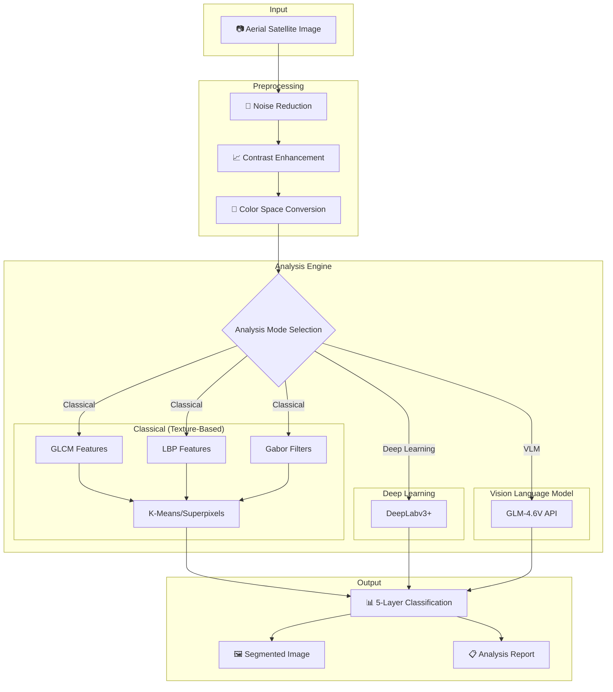

<div align="center">
# 🛣️ Automated Road Surface Layers Analysis using Texture-Based Image Segmentation
</div>

<div align="center">


**Analyze road construction layers from aerial satellite images using classical image processing, deep learning, and Vision Language Models**

</div>

---

## 📚 Project Information

| **Project Title** | Automated Road Surface Layers Analysis using Texture-Based Image Segmentation |
|-----------|---------|
| **Course** | CSC566 - Image Processing |
| **Group Name** | ClaRity Group |
| **Group** | A4CDCS2306A |
| **Lecturer** | Ts. ZAABA BIN AHMAD |

### 👥 Group Members

| No. | Name | Student ID |
|:---:|------|:----------:|
| 1 | AMIR HAFIZI BIN MUSA | 2024745815 |
| 2 | AQIL IMRAN BIN NORHIDZAM | 2024779269 |
| 3 | MUHAMMAD 'ADLI BIN MOHD ALI | 2024974573 |
| 4 | NIK MUHAMMAD HAZIQ BIN NIK HASNI | 2024741073 |

---

## 📋 Table of Contents

- [Overview](#-overview)
- [Road Layer Classification](#-road-layer-classification)
- [Features](#-features)
- [System Architecture](#-system-architecture)
- [Analysis Modes](#-analysis-modes)
- [Installation](#-installation)
- [Project Structure](#-project-structure)
- [Usage](#-usage)
- [GUI Interface](#-gui-interface)
- [Testing](#-testing)
- [Technical Details](#-technical-details)
- [Deliverables](#-deliverables)

---

## 🎯 Overview

This project implements an **automated system** for analyzing road construction layers from **Google Earth Pro aerial satellite images**. Using texture-based image segmentation techniques combined with optional deep learning and AI analysis, the system identifies and classifies **5 distinct road construction layers**.

### Project Information

| Attribute | Details |
|-----------|---------|
| **Course** | CSC566 - Image Processing |
| **Project Type** | Mini Project (30%) |
| **Dataset** | Google Earth Pro Aerial Satellite Images |
| **Language** | Python 3.10+ with CUDA GPU Acceleration |
| **Group** | ClaRity Group |

### Deliverables Breakdown

| Component | Weight | Description |
|-----------|--------|-------------|
| **Presentation** | 5% | System demo with GUI showcase |
| **Report** | 15% | Comprehensive methodology & results documentation |
| **Paper** | 10% | Academic paper with abstract, methodology, results |

---

## 🏗️ Road Layer Classification

The system classifies **5 distinct road construction layers**, representing the actual layers of road construction from bottom to top:

```
┌─────────────────────────────────────────────────────────────┐
│                    ROAD CROSS-SECTION                       │
├─────────────────────────────────────────────────────────────┤
│  ████████████████████████████████████████████████████████   │
│  █  Layer 5: SURFACE COURSE (Wearing Course - Premix)   █   │
│  ████████████████████████████████████████████████████████   │
│  ▓▓▓▓▓▓▓▓▓▓▓▓▓▓▓▓▓▓▓▓▓▓▓▓▓▓▓▓▓▓▓▓▓▓▓▓▓▓▓▓▓▓▓▓▓▓▓▓▓▓▓▓▓▓     │
│  ▓    Layer 4: BINDER COURSE (Premix with aggregate)    ▓   │
│  ▓▓▓▓▓▓▓▓▓▓▓▓▓▓▓▓▓▓▓▓▓▓▓▓▓▓▓▓▓▓▓▓▓▓▓▓▓▓▓▓▓▓▓▓▓▓▓▓▓▓▓▓▓▓     │
│  ░░░░░░░░░░░░░░░░░░░░░░░░░░░░░░░░░░░░░░░░░░░░░░░░░░░░░░░░   │
│  ░      Layer 3: BASE COURSE (Crushed Aggregate)        ░   │
│  ░░░░░░░░░░░░░░░░░░░░░░░░░░░░░░░░░░░░░░░░░░░░░░░░░░░░░░░░   │
│  ∴∴∴∴∴∴∴∴∴∴∴∴∴∴∴∴∴∴∴∴∴∴∴∴∴∴∴∴∴∴∴∴∴∴∴∴∴∴∴∴∴∴∴∴∴∴∴∴∴∴∴∴   │
│  ∴    Layer 2: SUBBASE COURSE (Coarse Aggregate)        ∴   │
│  ∴∴∴∴∴∴∴∴∴∴∴∴∴∴∴∴∴∴∴∴∴∴∴∴∴∴∴∴∴∴∴∴∴∴∴∴∴∴∴∴∴∴∴∴∴∴∴∴∴∴∴∴∴  │
│  ≋≋≋≋≋≋≋≋≋≋≋≋≋≋≋≋≋≋≋≋≋≋≋≋≋≋≋≋≋≋≋≋≋≋≋≋≋≋≋≋≋≋   │
│  ≋       Layer 1: SUBGRADE (In-site Soil/Backfill)      ≋  │
│  ≋≋≋≋≋≋≋≋≋≋≋≋≋≋≋≋≋≋≋≋≋≋≋≋≋≋≋≋≋≋≋≋≋≋≋≋≋≋≋≋≋≋≋≋│
└─────────────────────────────────────────────────────────────┘
```

### Layer Details

| Layer | Name | Material | Visual Characteristics | Texture Properties |
|:-----:|------|----------|------------------------|-------------------|
| **1** | Subgrade | In-site soil/backfill | Earth tones, irregular | High roughness, varied patterns |
| **2** | Subbase Course | Crushed aggregate (coarse) | Visible stones, rough | High contrast, granular |
| **3** | Base Course | Crushed aggregate (finer) | Uniform aggregate | Medium contrast, structured |
| **4** | Binder Course | Premix asphalt | Dark with visible stones | Low-medium homogeneity |
| **5** | Surface Course | Premix asphalt (smooth) | Uniform dark surface | High homogeneity, low contrast |

---

## ✨ Features

### Core Capabilities

- 🔬 **Texture-Based Analysis** - GLCM, LBP, Gabor filters for texture extraction
- 🎨 **Multi-Mode Segmentation** - K-Means, Watershed, Superpixels
- 🧠 **Deep Learning** - DeepLabv3+ semantic segmentation
- 🤖 **AI Analysis** - GLM-4.6V Vision Language Model integration
- 🖥️ **GUI Application** - Professional PyQt5 interface
- ⚡ **GPU Acceleration** - CUDA-enabled for fast processing
- 📊 **Comprehensive Reports** - Statistics, metrics, and visualizations

### Analysis Capabilities

| Feature | Description |
|---------|-------------|
| **Preprocessing** | Noise reduction, contrast enhancement, color space conversion |
| **Texture Features** | GLCM (Contrast, Energy, Homogeneity), LBP, Gabor |
| **Segmentation** | K-Means, Watershed, SLIC Superpixels |
| **Classification** | 5-class road layer classification |
| **Morphology** | Erosion, dilation, hole filling, connected components |

---

## 🏛️ System Architecture

### High-Level Architecture



### Data Flow Pipeline

```
┌──────────────────────────────────────────────────────────────────────────┐
│                           PROCESSING PIPELINE                            │
├──────────────────────────────────────────────────────────────────────────┤
│                                                                          │
│  ┌─────────┐    ┌──────────────┐    ┌────────────┐    ┌─────────────┐    │
│  │  INPUT  │──▶│ PREPROCESS   │───▶│  FEATURES  │──▶│  SEGMENT    │    │
│  │  Image  │    │              │    │            │    │             │    │
│  └─────────┘    │ • Denoise    │    │ • GLCM     │    │ • K-Means   │    │
│                 │ • CLAHE      │    │ • LBP      │    │ • Watershed │    │
│                 │ • RGB→HSV    │    │ • Gabor    │    │ • SLIC      │    │
│                 └──────────────┘    └────────────┘    └──────┬──────┘    │
│                                                              │           │
│                                                              ▼           │
│  ┌─────────┐    ┌──────────────┐    ┌────────────┐    ┌────────────┐     │
│  │ OUTPUT  │◀──│   REPORT     │◀───│  CLASSIFY  │◀──│ MORPHOLOGY │     │
│  │         │    │              │    │            │    │            │     │
│  │ • Image │    │ • Statistics │    │ • 5 Layers │    │ • Clean    │     │
│  │ • Stats │    │ • Metrics    │    │ • Conf %   │    │ • Fill     │     │
│  │ • Export│    │ • Confusion  │    │ • Material │    │ • Connect  │     │
│  └─────────┘    └──────────────┘    └────────────┘    └────────────┘     │
│                                                                          │
└──────────────────────────────────────────────────────────────────────────┘
```

---

## 🎛️ Analysis Modes

The system provides **4 distinct analysis modes**, each with configurable parameters:

### 1️⃣ Classical (Texture-Based)

Pure image processing using course-learned techniques:

```
┌─────────────────────────────────────────────────────────────────────────┐
│ ▼ PREPROCESSING                                                         │
│   Noise Filter:    [Median ▼]     Kernel Size:  [3x3 ▼]                 │
│   Contrast:        [CLAHE ▼]      Clip Limit:   [2.0 ────○────]         │
│   Color Space:     [○ RGB  ● HSV  ○ Lab]                                │
├─────────────────────────────────────────────────────────────────────────┤
│ ▼ TEXTURE FEATURES                                                      │
│   Features:        [☑ GLCM]  [☑ LBP]  [☐ Gabor]                       │
│   GLCM Distance:   [1, 2, 3]         Angles:  [0°, 45°, 90°, 135°]      │
│   LBP Radius:      [3 ────○────]     Points:  [24]                      │
├─────────────────────────────────────────────────────────────────────────┤
│ ▼ SEGMENTATION                                                          │
│   Method:          [K-Means ▼]                                          │
│   Clusters (K):    [5 ────○────]     (for 5 road layers)                │
│   Post-process:    [☑ Morphology]   [☑ Fill Holes]                     │
└─────────────────────────────────────────────────────────────────────────┘
```

**Processing Steps:**
1. **Preprocess** → Clean and enhance image
2. **Extract GLCM** → Calculate texture patterns (contrast, energy, homogeneity)
3. **Extract LBP** → Detect local texture patterns
4. **Segment** → Divide image into regions using K-Means
5. **Classify** → Match texture features to road layer
6. **Display** → Color-coded result with statistics

### 2️⃣ Deep Learning (DeepLabv3+)

CUDA-accelerated semantic segmentation:

```
┌─────────────────────────────────────────────────────────────────────────┐
│ ▼ MODEL SETTINGS                                                        │
│   Backbone:        [ResNet-101 ▼]                                       │
│   Pretrained:      [☑ ImageNet]  [☐ Custom Weights]                    │
│   Device:          [● CUDA (GPU)]   [○ CPU]                             │
├─────────────────────────────────────────────────────────────────────────┤
│ ▼ INFERENCE                                                             │
│   Confidence Threshold:   [0.5 ────○────]                               │
│   Batch Size:             [1 ▼]                                         │
│   Output Resolution:      [Original ▼]                                  │
└─────────────────────────────────────────────────────────────────────────┘
```

### 3️⃣ VLM Analysis (GLM-4.6V)

AI-powered analysis using Vision Language Model:

```
┌─────────────────────────────────────────────────────────────────────────┐
│ ▼ VLM SETTINGS                                                          │
│   Model:           GLM-4.6V (via ZenMux API)                            │
│   Analysis Type:   [● Layer ID]  [○ Detailed]  [○ Comparison]           │
│   Temperature:     [0.3 ────○────]                                      │
├─────────────────────────────────────────────────────────────────────────┤
│ ▼ OUTPUT OPTIONS                                                        │
│   Include:         [☑ Layer Name]  [☑ Confidence]  [☑ Material]       │
│                    [☑ Texture Description]  [☑ Recommendations]        │
└─────────────────────────────────────────────────────────────────────────┘
```

### 4️⃣ Hybrid (Classical + AI)

Combines classical analysis with AI validation:

```
┌─────────────────────────────────────────────────────────────────────────┐
│ ▼ HYBRID SETTINGS                                                       │
│   Primary Method:  [Classical ▼]                                        │
│   AI Validation:   [☑ Enable VLM Cross-Check]                          │
│   Weighting:       Classical [70%] ────○──── AI [30%]                   │
│   Conflict Rule:   [Higher Confidence Wins ▼]                           │
└─────────────────────────────────────────────────────────────────────────┘
```

---

## 🚀 Installation

### Prerequisites

- Python 3.10 or higher
- NVIDIA GPU with CUDA support (recommended)
- 8GB+ RAM

### Quick Start

```bash
# 1. Clone the repository
git clone https://github.com/your-repo/CSC566-Mini-Project.git
cd CSC566-Mini-Project

# 2. Create virtual environment
python -m venv .venv

# 3. Activate virtual environment
# Windows:
.venv\Scripts\activate
# Linux/Mac:
source .venv/bin/activate

# 4. Install dependencies
pip install -r requirements.txt

# 5. Create .env file for API keys
echo "ZENMUX_API_KEY=your_api_key_here" > .env

# 6. Run the application
python -m gui.main_window
```

### Dependencies

```txt
# Core Libraries
numpy>=1.24.0
opencv-python>=4.8.0
scikit-image>=0.21.0
scikit-learn>=1.3.0
scipy>=1.11.0
matplotlib>=3.7.0
pillow>=10.0.0

# GUI
PyQt5>=5.15.0

# Deep Learning
torch>=2.0.0
torchvision>=0.15.0
segmentation-models-pytorch>=0.3.0

# VLM Integration
requests>=2.31.0
python-dotenv>=1.0.0

# Testing
pytest>=7.4.0
pytest-cov>=4.1.0
pytest-benchmark>=4.0.0

# Utilities
tqdm>=4.66.0
```

---

## 📁 Project Structure

```
CSC566-Mini-Project/
│
├── 📄 README.md                    # This file
├── 📄 requirements.txt             # Python dependencies
├── 📄 .env                         # API keys (not in git)
├── 📄 .gitignore                   # Git ignore rules
│
├── 📁 data/                        # Dataset directory
│   ├── 📁 subgrade/                # Layer 1 images
│   ├── 📁 subbase/                 # Layer 2 images
│   ├── 📁 base_course/             # Layer 3 images
│   ├── 📁 binder_course/           # Layer 4 images
│   └── 📁 surface_course/          # Layer 5 images
│
├── 📁 src/                         # Source code
│   ├── 📄 __init__.py
│   ├── 📄 config.py                # Configuration & constants
│   ├── 📄 preprocessing.py         # Noise, contrast, color space
│   ├── 📄 texture_features.py      # GLCM, LBP, Gabor
│   ├── 📄 segmentation.py          # K-Means, Watershed, SLIC
│   ├── 📄 classification.py        # 5-layer classifier
│   ├── 📄 morphology.py            # Post-processing operations
│   ├── 📄 descriptors.py           # Boundary/region descriptors
│   ├── 📄 deep_learning.py         # DeepLabv3+ integration
│   ├── 📄 vlm_analyzer.py          # GLM-4.6V API integration
│   └── 📄 visualization.py         # Display utilities
│
├── 📁 gui/                         # GUI application
│   ├── 📄 __init__.py
│   ├── 📄 main_window.py           # Main application window
│   ├── 📄 image_panel.py           # Image display widget
│   ├── 📄 controls_panel.py        # Processing controls
│   └── 📄 results_panel.py         # Results & statistics
│
├── 📁 tests/                       # Test suite
│   ├── 📄 conftest.py              # Pytest fixtures
│   ├── 📄 test_preprocessing.py
│   ├── 📄 test_texture_features.py
│   ├── 📄 test_segmentation.py
│   ├── 📄 test_classification.py
│   ├── 📄 test_deep_learning.py
│   ├── 📄 test_vlm_analyzer.py
│   ├── 📄 test_integration.py
│   └── 📄 test_performance.py
│
└── 📁 results/                     # Output directory
    ├── 📁 segmented/               # Processed images
    ├── 📁 reports/                 # Analysis reports
    └── 📁 exports/                 # Exported data
```

---

## 💻 Usage

### GUI Application

```bash
# Launch the GUI
python -m gui.main_window
```

### Command Line Interface

```bash
# Analyze single image
python -m src.analyze --input path/to/image.jpg --mode classical

# Batch processing
python -m src.analyze --input data/subgrade/ --mode hybrid --output results/

# Run with specific parameters
python -m src.analyze --input image.jpg --mode classical \
    --filter median --features glcm,lbp --segmentation kmeans --k 5
```

### Python API

```python
from src.preprocessing import preprocess_image
from src.texture_features import extract_glcm_features, extract_lbp_features
from src.segmentation import kmeans_segment
from src.classification import RoadLayerClassifier

# Load and preprocess
image = cv2.imread("aerial_image.jpg")
preprocessed = preprocess_image(image, denoise="median", enhance="clahe")

# Extract features
glcm = extract_glcm_features(preprocessed)
lbp = extract_lbp_features(preprocessed)

# Segment and classify
segments = kmeans_segment(preprocessed, k=5)
classifier = RoadLayerClassifier()
result = classifier.predict(glcm, lbp)

print(f"Detected Layer: {result['layer_name']}")
print(f"Confidence: {result['confidence']:.2%}")
```

---

## 🖥️ GUI Interface

```
┌─────────────────────────────────────────────────────────────────────────┐
│  🛣️ Road Surface Layer Analyzer                           [—] [□] [X]  │
├─────────────────────────────────────────────────────────────────────────┤
│ File   Edit   Processing   Analysis   View   Help                       │
├─────────────────────────────────────────────────────────────────────────┤
│ ┌───────────────────────┐  ┌─────────────────────────────────────────┐  │
│ │                       │  │                                         │  │
│ │    📷 Original        │  │    🎨 Segmented Result                 │  │
│ │       Image           │  │    (Color-coded by layer)               │  │
│ │                       │  │                                         │  │
│ │                       │  │                                         │  │
│ └───────────────────────┘  └─────────────────────────────────────────┘  │
├─────────────────────────────────────────────────────────────────────────┤
│ Analysis Mode:                                                          │
│  ● Classical (Texture-based)  ○ Deep Learning (DeepLabv3+)              │
│  ○ VLM Analysis (GLM-4.6V)    ○ Hybrid (Classical + AI)                 │
├─────────────────────────────────────────────────────────────────────────┤
│ Layer Legend:                                                           │
│  ■ Subgrade  ■ Subbase  ■ Base Course  ■ Binder  ■ Surface              │
├─────────────────────────────────────────────────────────────────────────┤
│ 📊 Results:                                                            │
│ ┌─────────────────────────────────────────────────────────────────────┐ │
│ │ Detected Layer: Surface Course (Wearing Course)                     │ │
│ │ Confidence: 94.2%                                                   │ │
│ │ Material: Premix asphalt with fine aggregate                        │ │
│ │ Texture: Smooth, uniform, low roughness                             │ │
│ │ ──────────────────────────────────────────────────────────────────  │ │
│ │ GLCM Contrast: 0.23 | Energy: 0.78 | Homogeneity: 0.92              │ │
│ │ LBP Uniformity: 0.85 | Processing Time: 1.24s                       │ │
│ └─────────────────────────────────────────────────────────────────────┘ │
├─────────────────────────────────────────────────────────────────────────┤
│ [📂 Load Image]  [▶ Analyze]  [💾 Export]  [📊 Batch Process]         │
└─────────────────────────────────────────────────────────────────────────┘
```

---

## 🧪 Testing

### Run All Tests

```bash
# Run complete test suite with coverage
pytest tests/ -v --cov=src --cov-report=html --cov-fail-under=80

# View coverage report
open htmlcov/index.html
```

### Test Specific Modules

```bash
pytest tests/test_preprocessing.py -v      # Preprocessing tests
pytest tests/test_texture_features.py -v   # Feature extraction tests
pytest tests/test_segmentation.py -v       # Segmentation tests
pytest tests/test_classification.py -v     # Classification tests
pytest tests/test_deep_learning.py -v      # DeepLabv3+ tests
pytest tests/test_vlm_analyzer.py -v       # VLM integration tests
pytest tests/test_integration.py -v        # Full pipeline tests
pytest tests/test_performance.py -v        # Performance benchmarks
```

### 6-Pass Quality Review

| Pass | Focus | Command/Method |
|:----:|-------|----------------|
| 1 | Code Correctness | `pytest tests/ -v` + `flake8 src/` |
| 2 | Logic Flow | Manual review + flowchart validation |
| 3 | Architecture | Dependency check + SOLID principles |
| 4 | Test Coverage | `pytest --cov-fail-under=80` |
| 5 | Edge Cases | Boundary condition tests |
| 6 | Performance | `pytest tests/test_performance.py --benchmark` |

---

## 🔧 Technical Details

### Texture Features

#### GLCM (Gray-Level Co-occurrence Matrix)

| Feature | Description | Road Layer Correlation |
|---------|-------------|------------------------|
| **Contrast** | Local intensity variation | High → Aggregate layers |
| **Energy** | Texture uniformity | High → Surface course |
| **Homogeneity** | Closeness to diagonal | High → Smooth surfaces |
| **Correlation** | Linear dependency | Varies by material |

#### LBP (Local Binary Patterns)

- Captures local texture patterns
- Rotation-invariant descriptors
- Histogram-based features

### Segmentation Methods

| Method | Best For | Parameters |
|--------|----------|------------|
| **K-Means** | Color-based regions | K clusters |
| **Watershed** | Clear boundaries | Markers |
| **SLIC** | Superpixel regions | N superpixels |

### Deep Learning Model

- **Architecture**: DeepLabv3+ with ResNet-101 backbone
- **Training**: Fine-tuned on road layer dataset
- **Inference**: CUDA-accelerated, ~50ms per image

---

## 📦 Deliverables

| Deliverable | Description |
|-------------|-------------|
| **Source Code** | Python modules with comprehensive comments |
| **GUI Application** | PyQt5-based interface |
| **Test Suite** | Automated tests with >80% coverage |
| **Report** | Methodology, results, discussion |
| **Paper** | Academic format with references |
| **Presentation** | 5-minute demo with GUI showcase |

---

## 📄 License

This project is for academic purposes as part of the CSC566 Image Processing course.

---

<div align="center">

**Made by ClaRity Group**

*CSC566 Image Processing | UiTM Cawangan Perak Kampus Tapah*

</div>
