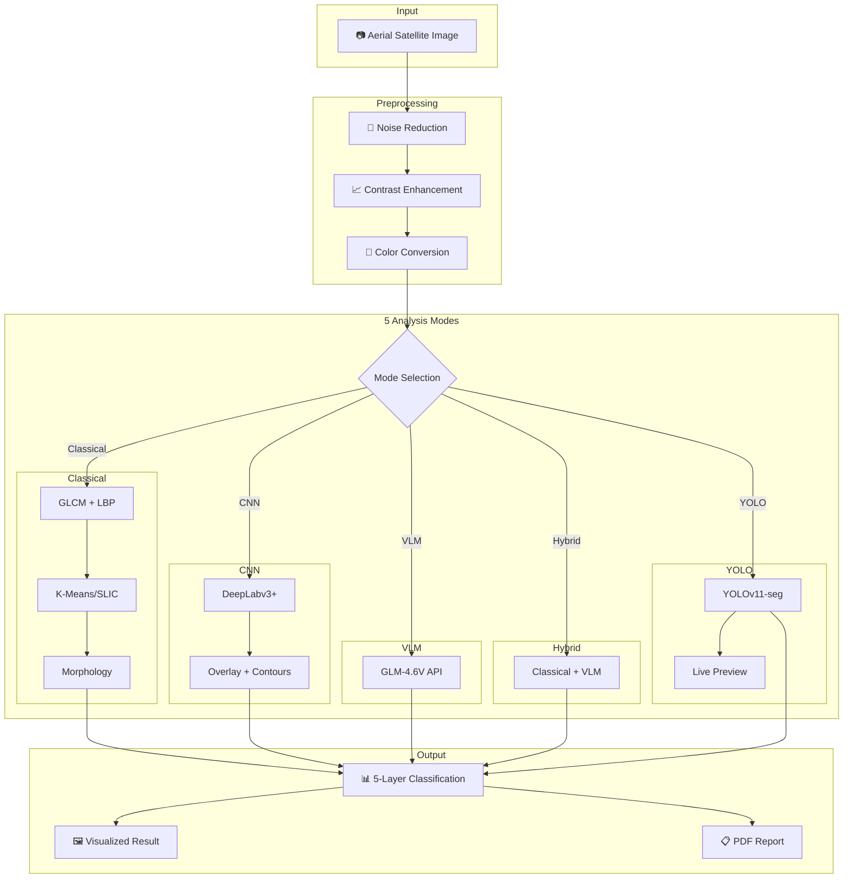

# 🛣️ ClaRity - Road Surface Layer Analyzer

<div align="center">


**Analyze road construction layers from aerial satellite images using Classical Image Processing, Deep Learning, Vision Language Models, and Instance Segmentation**

</div>

---

## 📚 Project Information

| **Project Title** | Automated Road Surface Layer Identification and Analysis using Multi-Method Image Processing System |
|-------------------|------------------------------------------------------------------------------------------------------|
| **Course**        | CSC566 - Image Processing                                                                            |
| **Group Name**    | ClaRity Group                                                                                        |
| **Group**         | A4CDCS2306A                                                                                          |
| **Lecturer**      | Ts. ZAABA BIN AHMAD                                                                                  |

### 👥 Group Members

| No. | Name                                  | Student ID |
|:---:|---------------------------------------|:----------:|
| 1   | AMIR HAFIZI BIN MUSA                  | 2024745815 |
| 2   | AQIL IMRAN BIN NORHIDZAM              | 2024779269 |
| 3   | MUHAMMAD 'ADLI BIN MOHD ALI           | 2024974573 |
| 4   | NIK MUHAMMAD HAZIQ BIN NIK HASNI      | 2024741073 |

---

## 📋 Table of Contents

- [Overview](#-overview)
- [Road Layer Classification](#-road-layer-classification)
- [Features](#-features)
- [5 Analysis Modes](#-5-analysis-modes)
- [System Architecture](#-system-architecture)
- [Installation](#-installation)
- [Quick Start](#-quick-start)
- [Project Structure](#-project-structure)
- [GUI Interface](#-gui-interface)
- [Technical Details](#-technical-details)
- [Testing](#-testing)

---

## 🎯 Overview

This project implements an **automated multi-method system** for analyzing road construction layers from **Google Earth Pro aerial satellite images**. The system combines **5 distinct analysis approaches** to identify and classify **5 road construction layers** with high accuracy.

### Key Highlights

| Feature | Description |
|---------|-------------|
| 🔬 **Classical Analysis** | GLCM, LBP texture features with K-Means/SLIC/Watershed segmentation + result dialogs |
| 🧠 **CNN Deep Learning** | DeepLabv3+ semantic segmentation with overlay visualization & instance contours |
| 🤖 **VLM Analysis** | GLM-4.6V Vision Language Model with edge-enhanced visualization |
| 🔀 **Hybrid Mode** | Classical + VLM validation with configurable conflict resolution |
| 🎯 **YOLOv11** | Real-time instance segmentation with Live Preview & window capture |
| 🖥️ **Professional GUI** | PyQt5 dark theme with drag-drop, animated splash screen, PDF export |
| ⚡ **CUDA Acceleration** | GPU-accelerated inference for DeepLab and YOLO models |

---

## 🏗️ Road Layer Classification

The system classifies **5 distinct road construction layers** from bottom to top:

```
┌─────────────────────────────────────────────────────────────┐
│                    ROAD CROSS-SECTION                       │
├─────────────────────────────────────────────────────────────┤
│  ████████████████████████████████████████████████████████   │
│  █  Layer 5: SURFACE COURSE (Wearing Course - Premix)   █   │
│  ████████████████████████████████████████████████████████   │
│  ▓▓▓▓▓▓▓▓▓▓▓▓▓▓▓▓▓▓▓▓▓▓▓▓▓▓▓▓▓▓▓▓▓▓▓▓▓▓▓▓▓▓▓▓▓▓▓▓▓▓▓▓▓▓     │
│  ▓    Layer 4: BINDER COURSE (Premix with aggregate)    ▓   │
│  ▓▓▓▓▓▓▓▓▓▓▓▓▓▓▓▓▓▓▓▓▓▓▓▓▓▓▓▓▓▓▓▓▓▓▓▓▓▓▓▓▓▓▓▓▓▓▓▓▓▓▓▓▓▓     │
│  ░░░░░░░░░░░░░░░░░░░░░░░░░░░░░░░░░░░░░░░░░░░░░░░░░░░░░░░░   │
│  ░      Layer 3: BASE COURSE (Crushed Aggregate)        ░   │
│  ░░░░░░░░░░░░░░░░░░░░░░░░░░░░░░░░░░░░░░░░░░░░░░░░░░░░░░░░   │
│  ∴∴∴∴∴∴∴∴∴∴∴∴∴∴∴∴∴∴∴∴∴∴∴∴∴∴∴∴∴∴∴∴∴∴∴∴∴∴∴∴∴∴∴∴∴∴∴∴∴∴∴∴∴     │
│  ∴    Layer 2: SUBBASE COURSE (Coarse Aggregate)        ∴   │
│  ∴∴∴∴∴∴∴∴∴∴∴∴∴∴∴∴∴∴∴∴∴∴∴∴∴∴∴∴∴∴∴∴∴∴∴∴∴∴∴∴∴∴∴∴∴∴∴∴∴∴∴∴∴     │
│  ≋≋≋≋≋≋≋≋≋≋≋≋≋≋≋≋≋≋≋≋≋≋≋≋≋≋≋≋≋≋≋≋≋≋≋≋≋≋≋≋≋≋≋≋≋≋≋≋≋≋≋≋≋     │
│  ≋       Layer 1: SUBGRADE (In-site Soil/Backfill)      ≋   │
│  ≋≋≋≋≋≋≋≋≋≋≋≋≋≋≋≋≋≋≋≋≋≋≋≋≋≋≋≋≋≋≋≋≋≋≋≋≋≋≋≋≋≋≋≋≋≋≋≋≋≋≋≋≋     │
└─────────────────────────────────────────────────────────────┘
```

### Layer Details

| Layer | Name | Material | Color (Display) | Texture Properties |
|:-----:|------|----------|-----------------|-------------------|
| **1** | Subgrade | In-site soil/backfill | Brown | High roughness, varied patterns |
| **2** | Subbase Course | Crushed aggregate (coarse) | Tan/Beige | High contrast, granular |
| **3** | Base Course | Crushed aggregate (finer) | Light pinkish-gray | Medium contrast, structured |
| **4** | Binder Course | Premix asphalt | Orange-brown | Low-medium homogeneity |
| **5** | Surface Course | Premix asphalt (smooth) | Dark blue-gray | High homogeneity, low contrast |

---

## ✨ Features

### Core Capabilities

| Category | Features |
|----------|----------|
| **Preprocessing** | Median/Gaussian/Bilateral noise filters, CLAHE contrast enhancement, Sharpening |
| **Texture Features** | GLCM (Contrast, Energy, Homogeneity, Correlation), LBP patterns, Gabor filters |
| **Segmentation** | K-Means clustering, SLIC Superpixels, Watershed algorithm, Morphological operations |
| **Deep Learning** | DeepLabv3+ semantic segmentation, YOLOv11 instance segmentation |
| **AI Analysis** | GLM-4.6V Vision Language Model with detailed/quick scan modes |
| **Visualization** | Overlay on original image, instance contours, info banners, color-coded legends |
| **GUI** | Dark theme, drag-drop support, animated splash screen, live preview, PDF export |

### Result Dialogs (Classical Mode)

Classical mode includes **detailed result dialogs** showing intermediate processing steps:

- **Image Segmentation Results**: Original → Sobel Edge → Dilated Gradient → Filled Holes → Erosion Mask → Segmented
- **Texture Feature Extraction**: Original → Binarization → Segmented → Grayscale → ROI + Statistics

---

## 🎛️ 5 Analysis Modes

### 1️⃣ Classical (Texture-Based)

Pure image processing using texture analysis and segmentation.

| Component | Options |
|-----------|---------|
| **Preprocessing** | Median/Gaussian/Bilateral filter, CLAHE, Sharpening |
| **Features** | GLCM, LBP, Gabor (optional) |
| **Segmentation** | K-Means, SLIC Superpixels, Watershed |
| **Post-Processing** | Morphology (Open/Close), Hole filling |
| **Output** | Segmentation result + 2 detail dialogs with intermediate images |

---

### 2️⃣ CNN Deep Learning (DeepLabv3+)

CUDA-accelerated semantic segmentation with **overlay visualization**.

| Setting | Options |
|---------|---------|
| **Backbone** | ResNet-50, ResNet-101, EfficientNet |
| **Pretrained** | ImageNet weights or custom |
| **Device** | CUDA (GPU) or CPU |
| **Resolution** | 256×256, 512×512, Original |
| **Visualization** | Colored overlay on original + instance contours + info banner |

**New Features:**
- Semi-transparent segmentation overlay blended with original image
- Instance segmentation contours around detected regions
- Top banner showing layer name, confidence, and layer count

---

### 3️⃣ VLM Analysis (GLM-4.6V)

AI-powered analysis using Vision Language Model via ZenMux API.

| Setting | Options |
|---------|---------|
| **Analysis Type** | Layer ID, Detailed, Quick Scan |
| **Temperature** | 0.0 - 1.0 (creativity control) |
| **Output** | Layer name, confidence, material, texture description, recommendations |
| **Visualization** | Muted/sharpened image with green bounding box, edge overlay, info banner |

---

### 4️⃣ Hybrid (Classical + VLM)

Combines classical analysis with AI validation for highest accuracy.

| Setting | Options |
|---------|---------|
| **VLM Cross-Check** | Enable/Disable |
| **Weight Slider** | 0-100% Classical vs AI balance |
| **Conflict Rules** | Higher Confidence Wins, Classical Priority, VLM Priority, Weighted Average |

---

### 5️⃣ YOLOv11 Instance Segmentation

Real-time instance segmentation with **Live Preview** mode.

| Setting | Options |
|---------|---------|
| **Model** | YOLOv11-seg (auto-downloaded) |
| **Device** | CUDA (GPU) or CPU |
| **Confidence** | 0.0 - 1.0 threshold |
| **IOU Threshold** | Non-max suppression |
| **Visualization** | Colored masks, labels, confidence scores |
| **Live Preview** | Real-time window capture with FPS display |

**Live Preview Features:**
- Select any window for real-time analysis
- Adjustable capture FPS (1-30)
- Live YOLO inference with GPU acceleration
- Capture current frame for detailed analysis

---

## 🏛️ System Architecture


```mermaid
flowchart TB
    subgraph Input
        A[📷 Aerial Satellite Image]
    end
    
    subgraph Preprocessing
        B[🔧 Noise Reduction]
        C[📈 Contrast Enhancement]
        D[🎨 Color Conversion]
    end
    
    subgraph Analysis["5 Analysis Modes"]
        E{Mode Selection}
        
        subgraph Classical
            F1[GLCM + LBP]
            F2[K-Means/SLIC]
            F3[Morphology]
        end
        
        subgraph CNN
            G[DeepLabv3+]
            G2[Overlay + Contours]
        end
        
        subgraph VLM
            H[GLM-4.6V API]
        end
        
        subgraph Hybrid
            I[Classical + VLM]
        end
        
        subgraph YOLO
            J[YOLOv11-seg]
            J2[Live Preview]
        end
    end
    
    subgraph Output
        K[📊 5-Layer Classification]
        L[🖼️ Visualized Result]
        M[📋 PDF Report]
    end
    
    A --> B --> C --> D --> E
    E -->|Classical| F1 --> F2 --> F3 --> K
    E -->|CNN| G --> G2 --> K
    E -->|VLM| H --> K
    E -->|Hybrid| I --> K
    E -->|YOLO| J --> K
    J --> J2
    K --> L & M
```

---

## 🚀 Installation

### Prerequisites

- **Python 3.10+**
- **NVIDIA GPU** with CUDA support (recommended)
- **8GB+ RAM**
- **ZenMux API Key** (for VLM mode)

### Quick Start

```bash
# 1. Clone the repository
git clone https://github.com/YoRzHe-HotaaRu/CSC566-Mini-Project-ClaRity.git
cd CSC566-Mini-Project-ClaRity

# 2. Create virtual environment
python -m venv .venv

# 3. Activate virtual environment
# Windows:
.venv\Scripts\activate
# Linux/Mac:
source .venv/bin/activate

# 4. Install dependencies
pip install -r requirements.txt

# 5. Create .env file for API key
echo "ZENMUX_API_KEY=your_api_key_here" > .env

# 6. Run the application
python -m gui.main_window
```

### Alternative: Use run.bat (Windows)

```bash
# Simply double-click run.bat or:
.\run.bat
```

This automatically activates the virtual environment and launches the GUI.

---

## 📁 Project Structure

```
CSC566-Mini-Project-ClaRity/
│
├── 📄 README.md                    # This file
├── 📄 requirements.txt             # Python dependencies
├── 📄 run.bat                      # Windows launcher script
├── 📄 .env                         # API keys (not in git)
│
├── 📁 src/                         # Source modules
│   ├── 📄 config.py                # Configuration & layer colors
│   ├── 📄 preprocessing.py         # Noise, contrast, color space
│   ├── 📄 texture_features.py      # GLCM, LBP, Gabor extraction
│   ├── 📄 segmentation.py          # K-Means, Watershed, SLIC
│   ├── 📄 classification.py        # 5-layer classifier
│   ├── 📄 morphology.py            # Post-processing operations
│   ├── 📄 deep_learning.py         # DeepLabv3+ integration
│   ├── 📄 vlm_analyzer.py          # GLM-4.6V API integration
│   ├── 📄 yolo_analyzer.py         # YOLOv11 instance segmentation
│   ├── 📄 visualization.py         # Display utilities
│   └── 📄 report_generator.py      # PDF report generation
│
├── 📁 gui/                         # GUI application
│   ├── 📄 main_window.py           # Main application (2500+ lines)
│   ├── 📄 splash_screen.py         # Animated splash screen
│   ├── 📄 classical_results.py     # Result dialogs for Classical mode
│   └── 📄 window_capture.py        # Live preview window capture
│
├── 📁 data/                        # Sample images (by layer)
│   ├── 📁 subgrade/
│   ├── 📁 subbase/
│   ├── 📁 base_course/
│   ├── 📁 binder_course/
│   └── 📁 surface_course/
│
├── 📁 models/                      # Model weights
│   └── 📁 yolo/                    # YOLOv11 weights (auto-downloaded)
│
├── 📁 results/                     # Output directory
│   ├── 📁 reports/                 # PDF reports
│   └── 📁 exports/                 # Exported images
│
└── 📁 tests/                       # Test suite
    ├── 📄 test_preprocessing.py
    ├── 📄 test_texture_features.py
    ├── 📄 test_segmentation.py
    └── 📄 test_integration.py
```

---

## 🖥️ GUI Interface

### Main Window Layout

```
┌─────────────────────────────────────────────────────────────────────────┐
│  🛣️ Road Surface Layer Analyzer - ClaRity                   [—] [□] [X] │
├─────────────────────────────────────────────────────────────────────────┤
│ ┌───────────────────────┐  ┌─────────────────────────────────────────┐  │
│ │    📷 Original        │  │    🎨 Segmentation Result               │  │
│ │       Image           │  │    (Overlay with contours)              │  │
│ │   (Drag & Drop)       │  │                                         │  │
│ └───────────────────────┘  └─────────────────────────────────────────┘  │
├─────────────────────────────────────────────────────────────────────────┤
│ Analysis Mode:                                                          │
│  [Classical] [CNN] [VLM] [Hybrid] [YOLOv11]                            │
├─────────────────────────────────────────────────────────────────────────┤
│ Mode-specific settings panel (changes based on selected mode)           │
├─────────────────────────────────────────────────────────────────────────┤
│ [📂 Load Image]  [▶ Analyze]  [📊 Export]                              │
├─────────────────────────────────────────────────────────────────────────┤
│ 📊 Results:                                                             │
│ ┌─────────────────────────────────────────────────────────────────────┐ │
│ │ Detected Layer: Surface Course (Layer 5)                            │ │
│ │ Confidence: 94.2%                                                    │ │
│ │ Material: Premix asphalt (smooth)                                    │ │
│ │ Method: DeepLabv3+ (ResNet-101, CUDA)                                │ │
│ └─────────────────────────────────────────────────────────────────────┘ │
├─────────────────────────────────────────────────────────────────────────┤
│ Layer Legend:                                                           │
│ [Subgrade] [Subbase Course] [Base Course] [Binder Course] [✓Surface]   │
└─────────────────────────────────────────────────────────────────────────┘
```

### Features

- **Drag & Drop**: Drop images directly onto the Original Image panel
- **Mode Buttons**: Toggle between 5 analysis modes with mode-specific settings
- **Live Legend**: Shows all 5 layers, highlights detected layer
- **Progress Bar**: Real-time progress during analysis
- **PDF Export**: Save complete analysis report with images and statistics

---

## 🔧 Technical Details

### Texture Features

| Feature | Description | Layer Correlation |
|---------|-------------|-------------------|
| **GLCM Contrast** | Local intensity variation | High → Aggregate layers |
| **GLCM Energy** | Texture uniformity | High → Surface course |
| **GLCM Homogeneity** | Closeness to diagonal | High → Smooth surfaces |
| **LBP Histogram** | Local binary patterns | Captures micro-textures |

### Deep Learning Models

| Model | Architecture | Use Case |
|-------|--------------|----------|
| **DeepLabv3+** | ResNet-101 backbone | Semantic segmentation |
| **YOLOv11-seg** | CSPDarknet backbone | Instance segmentation |

### Visualization Techniques

| Mode | Visualization Style |
|------|---------------------|
| **Classical** | Colored segmentation + 2 detail dialogs |
| **CNN** | 40% colored overlay + instance contours + info banner |
| **VLM** | Muted image + green box + edges + banner |
| **Hybrid** | Same as Classical (uses Classical segmentation) |
| **YOLO** | Colored masks + labels + confidence |

---

## 🧪 Testing

### Run All Tests

```bash
# Run complete test suite
pytest tests/ -v

# With coverage report
pytest tests/ -v --cov=src --cov-report=html

# View coverage
start htmlcov/index.html  # Windows
open htmlcov/index.html   # Mac
```

### Test Specific Modules

```bash
pytest tests/test_preprocessing.py -v
pytest tests/test_texture_features.py -v
pytest tests/test_segmentation.py -v
pytest tests/test_integration.py -v
```

---

## 📦 Dependencies

```txt
# Core
numpy>=1.24.0
opencv-python>=4.8.0
scikit-image>=0.21.0
scikit-learn>=1.3.0
scipy>=1.11.0
matplotlib>=3.7.0
pillow>=10.0.0

# GUI
PyQt5>=5.15.0

# Deep Learning
torch>=2.0.0
torchvision>=0.15.0
segmentation-models-pytorch>=0.3.0
ultralytics>=8.0.0  # YOLOv11

# VLM Integration
requests>=2.31.0
python-dotenv>=1.0.0

# PDF Export
reportlab>=4.0.0

# Utilities
tqdm>=4.66.0
pywin32>=306  # Windows window capture
```

---

## 📄 License

This project is for academic purposes as part of the CSC566 Image Processing course.

---

<div align="center">

**Made with ❤️ by ClaRity Group**

*CSC566 Image Processing | UiTM Cawangan Perak Kampus Tapah*

</div>
