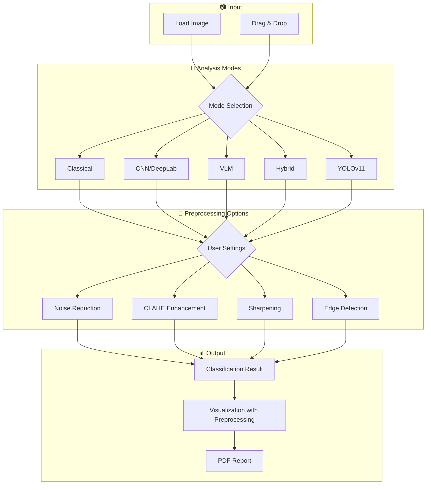
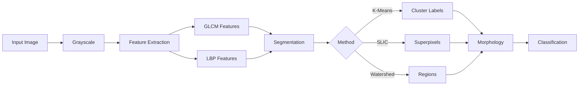
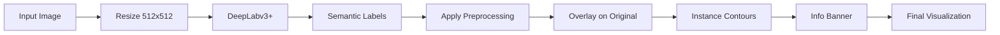
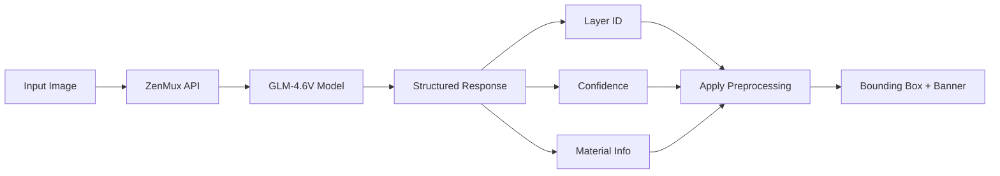
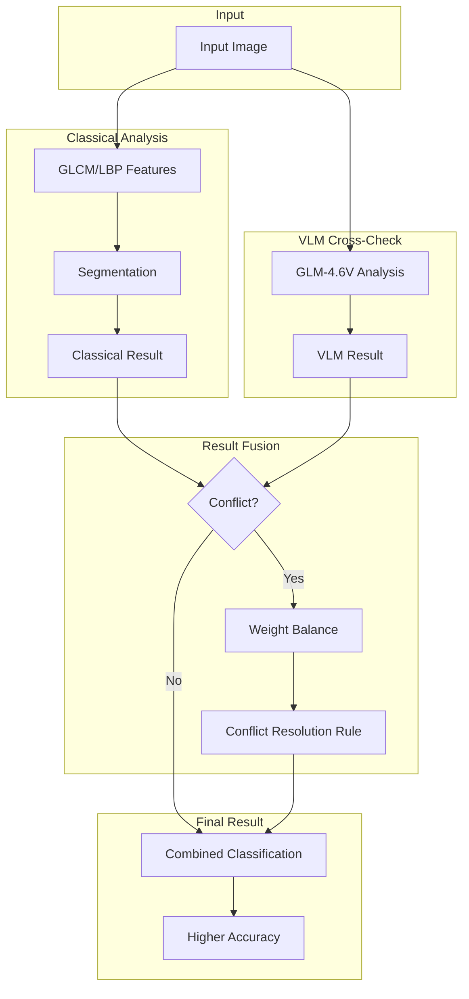
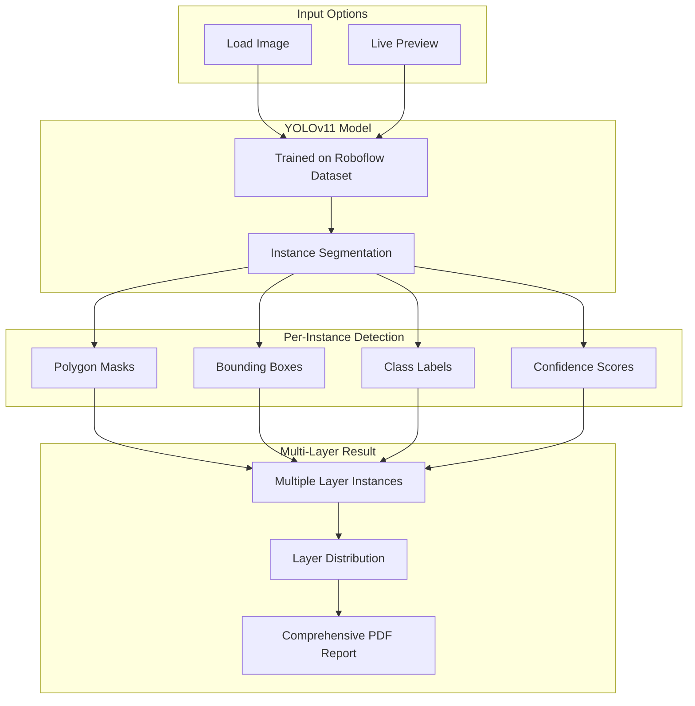

# CSC566 MINI PROJECT REPORT

**Project Title:** Automated Road Surface Layer Identification and Analysis using Multi-Method Image Processing Method

**Course:** CSC566 - Image Processing  
**Group:** ClaRity Group (A4CDCS2306A)  
**Lecturer:** Ts. ZAABA BIN AHMAD

| No. | Name | Student ID |
|:---:|------|:----------:|
| 1 | AMIR HAFIZI BIN MUSA | 2024745815 |
| 2 | AQIL IMRAN BIN NORHIDZAM | 2024779269 |
| 3 | MUHAMMAD 'ADLI BIN MOHD ALI | 2024974573 |
| 4 | NIK MUHAMMAD HAZIQ BIN NIK HASNI | 2024741073 |

---

## 1. Introduction

Road infrastructure plays a critical role in transportation and urban development. Proper construction and maintenance of roads require accurate identification of the various layers that make up the road structure. This project addresses the challenge of automating the analysis of road construction layers using image processing techniques applied to aerial satellite imagery from Google Earth Pro.

The road construction process involves laying multiple layers, each with distinct materials and characteristics. Our system identifies and classifies **five road construction layers**:

| Layer | Name | Material | Visual Characteristics |
|:-----:|------|----------|------------------------|
| 1 | Subgrade | In-site soil/backfill | Brown earth tones, irregular texture |
| 2 | Subbase Course | Crushed aggregate (coarse) | Visible stones, rough surface |
| 3 | Base Course | Crushed aggregate (finer) | Uniform aggregate, medium texture |
| 4 | Binder Course | Premix asphalt | Dark with visible stones |
| 5 | Surface Course | Premix asphalt (smooth) | Smooth, uniform dark surface |

The system implements a **multi-method approach** combining:
- Classical Image Processing (GLCM, LBP texture analysis)
- Deep Learning (DeepLabv3+ semantic segmentation)
- Vision Language Model (GLM-4.6V AI analysis)
- Instance Segmentation (YOLOv11 with live preview)
- Hybrid Analysis (Classical + VLM cross-validation)

Built using Python 3.10+ with PyQt5 GUI and CUDA GPU acceleration, the application provides a professional interface for road infrastructure monitoring and construction quality assessment.

> 📷 **[Insert Screenshot: Application main interface showing loaded image and analysis result]**

---

## 2. Objectives

The primary objective of this project is to develop an automated pipeline capable of accurately classifying five distinct road construction layers from aerial satellite images. This involves creating a system that can distinguish between layers based on their visual and textural characteristics without requiring manual inspection.

| No. | Objective |
|:---:|-----------|
| 1 | Develop an automated pipeline for classifying **five road layers**: Subgrade, Subbase Course, Base Course, Binder Course, and Surface Course |
| 2 | Implement **texture-based feature extraction** using GLCM (Contrast, Energy, Homogeneity, Correlation) and Local Binary Patterns (LBP) |
| 3 | Provide a **multi-mode analysis interface** with 5 distinct analysis methods |
| 4 | Deliver a **professional PyQt5 GUI** with real-time processing and visualization |
| 5 | Implement **CUDA GPU acceleration** for efficient processing |
| 6 | Integrate **configurable preprocessing options** (Sharpen, Edge Detection, Noise Reduction, CLAHE) |

### Objective Details

**Objective 1** focuses on building a robust classification pipeline that can accurately identify all five standard road construction layers. This requires understanding the visual differences between each layer's materials - from the raw soil of the subgrade to the smooth asphalt of the surface course. The pipeline must handle variations in lighting, camera angle, and image resolution.

**Objective 2** involves implementing classical image processing techniques for texture analysis. GLCM (Gray Level Co-occurrence Matrix) extracts statistical features like contrast, energy, homogeneity, and correlation that describe surface roughness and uniformity. LBP (Local Binary Patterns) captures micro-texture patterns that help distinguish between aggregate and asphalt surfaces.

**Objective 3** recognizes that different analysis scenarios benefit from different approaches. Classical mode works well for clear textures, CNN provides semantic understanding, VLM offers AI-powered explanations, Hybrid combines methods for higher accuracy, and YOLOv11 enables real-time instance detection.

**Objective 4** emphasizes user experience through a professional PyQt5 interface with a modern dark theme, intuitive drag-and-drop image loading, real-time progress feedback, and comprehensive PDF report generation for documentation purposes.

**Objective 5** leverages GPU acceleration through CUDA to ensure fast inference times, especially for deep learning models like DeepLabv3+ and YOLOv11 that process high-resolution satellite imagery.

**Objective 6** provides users with configurable preprocessing options that apply enhancements to the visualization output, including image sharpening, edge detection overlay, bilateral noise reduction, and CLAHE contrast enhancement in a 2×2 grid layout.

---

## 3. Data Collection

### Google Earth Pro Dataset

The images used for Classical and CNN modes are sourced from **Google Earth Pro**, which provides high-resolution aerial satellite imagery of road construction sites at various stages of development.

#### Dataset Organization

The dataset is organized into five categories corresponding to the five road layers:

```
data/
├── subgrade/          # Layer 1 - Foundation soil images (~50 images)
├── subbase/           # Layer 2 - Coarse aggregate images (~40 images)
├── base_course/       # Layer 3 - Fine aggregate images (~39 images)
├── binder_course/     # Layer 4 - Initial asphalt images (~45 images)
└── surface_course/    # Layer 5 - Wearing surface images (~71 images)
```

### Roboflow Dataset for YOLOv11

For the YOLOv11 instance segmentation model, we created and annotated a custom dataset hosted on **Roboflow Universe**:

| Property | Details |
|----------|---------|
| **Platform** | Roboflow Universe |
| **Dataset Name** | Malaysia Aerial Satellite Road Layers Segmentation |
| **URL** | [universe.roboflow.com/vulkan747codez/malaysia-aerial-satellite-road-layers-segmentation](https://universe.roboflow.com/vulkan747codez/malaysia-aerial-satellite-road-layers-segmentation) |
| **Annotation Type** | Instance Segmentation (Polygon masks) |
| **Classes** | 5 road layer classes |
| **Annotated By** | ClaRity Team |

The Roboflow dataset was carefully annotated with polygon masks for each road layer instance, enabling the YOLOv11 model to perform precise instance segmentation rather than simple object detection.

### Image Characteristics

Each layer exhibits unique visual properties that can be identified through image analysis:

| Layer | Texture Properties | Key Features |
|-------|-------------------|--------------|
| Subgrade | High roughness, varied patterns | Earth tones, irregular surface |
| Subbase | High contrast, granular | Visible coarse stones |
| Base Course | Medium contrast, structured | Uniform aggregate pattern |
| Binder Course | Low-medium homogeneity | Dark with visible aggregate |
| Surface Course | High homogeneity, low contrast | Smooth, uniform appearance |

When selecting images, we included samples with varying lighting conditions, angles, and resolutions to ensure the system can handle diverse real-world scenarios.

> 📷 **[Insert Image: Sample images showing each of the 5 road layers]**

---

## 4. Flowchart

### Main System Architecture

The following diagram shows the overall system architecture and data flow:



### Classical Analysis Mode Flow



### Deep Learning (CNN) Mode Flow



### VLM Analysis Mode Flow



### Hybrid Analysis Mode Flow




### YOLOv11 Instance Segmentation Flow



> 📷 **[Insert Screenshot: Each analysis mode showing different visualization styles]**

---

## 5. Results of Prototype

The prototype successfully demonstrates the ability to identify and classify road construction layers using multiple analysis methods. Testing with various satellite images showed that the system can accurately distinguish between different layer types.

### Feature Extraction Results

The Classical analysis mode extracts texture features using GLCM and LBP:

| Feature | Description | Layer Correlation |
|---------|-------------|-------------------|
| GLCM Contrast | Local intensity variation | High → Rough aggregate layers |
| GLCM Energy | Texture uniformity | High → Smooth surfaces |
| GLCM Homogeneity | Local similarity | High → Uniform materials |
| LBP Histogram | Local binary patterns | Captures micro-textures |

### Classification Performance by Mode

| Mode | Processing Time | Strengths | Best For |
|------|-----------------|-----------|----------|
| Classical | 2-4 seconds | Fast, no GPU needed | Clear texture differences |
| CNN (GPU) | 1-2 seconds | Semantic understanding | Complex images |
| VLM | 3-5 seconds | AI explanations | Unknown materials |
| Hybrid | 4-6 seconds | Cross-validation | Highest accuracy |
| YOLOv11 | < 1 second | Real-time, multi-instance | Live monitoring |

### Preprocessing Options

Each mode supports configurable preprocessing options arranged in a 2×2 grid:

| Option | Effect | Method |
|--------|--------|--------|
| Sharpen Image | Enhances edge details | 3×3 sharpening kernel |
| Edge Detection Overlay | Highlights boundaries | Canny edge detector (green overlay) |
| Noise Reduction | Reduces image noise | Bilateral filter (edge-preserving) |
| Contrast Enhancement | Improves visibility | CLAHE on LAB color space |

### Key Findings

1. **Classical Mode** performed well on images with distinct textures. GLCM Energy was particularly effective for identifying smooth Surface Course layers.

2. **CNN Mode** using DeepLabv3+ provided pixel-level classification. Note: This mode uses ImageNet pretrained weights and is marked as experimental.

3. **VLM Mode** offered valuable natural language descriptions, helping users understand material properties and construction context.

4. **Hybrid Mode** improved accuracy by cross-validating Classical and VLM results, with configurable conflict resolution.

5. **YOLOv11 Mode** achieved real-time performance with the ability to detect **multiple layer instances** in a single image, making it ideal for complex construction sites.

> 📷 **[Insert Screenshot: Comparison of results from different analysis modes on the same image]**

---

## 6. System Prototype in GUI

The graphical user interface was designed with usability and professionalism in mind. The application uses a **dark theme** that reduces eye strain and provides a modern appearance.

### Main Interface Layout

```
┌─────────────────────────────────────────────────────────────────────────┐
│  Road Surface Layer Analyzer - ClaRity                      [—] [□] [X] │
├─────────────────────────────────────────────────────────────────────────┤
│ ┌───────────────────────┐  ┌───────────────────────────────────────────┐│
│ │                       │  │                                           ││
│ │    Original Image     │  │         Segmentation Result               ││
│ │    (Drag & Drop)      │  │    (Overlay with Contours + Banner)       ││
│ │                       │  │                                           ││
│ └───────────────────────┘  └───────────────────────────────────────────┘│
├─────────────────────────────────────────────────────────────────────────┤
│ Mode: [Classical] [CNN] [VLM] [Hybrid] [YOLOv11]                        │
├─────────────────────────────────────────────────────────────────────────┤
│ [Mode-specific settings + Preprocessing 2×2 grid]                       │
├─────────────────────────────────────────────────────────────────────────┤
│ [Load Image]  [▶ Analyze]  [Export PDF]                                 │
├─────────────────────────────────────────────────────────────────────────┤
│ Results: Detected Layer: Surface Course | Confidence: 94.2%            │
├─────────────────────────────────────────────────────────────────────────┤
│ Legend: [Subgrade] [Subbase] [Base] [Binder] [✓ Surface Course]        │
└─────────────────────────────────────────────────────────────────────────┘
```

### GUI Features

| Feature | Description |
|---------|-------------|
| **Dark Theme** | Professional appearance with reduced eye strain |
| **Drag & Drop** | Easy image loading by dropping files |
| **5 Analysis Modes** | Toggle buttons for mode selection |
| **Preprocessing Grid** | 2×2 layout: Sharpen, Edge, Noise, CLAHE |
| **Real-time Progress** | Progress bar during analysis |
| **Interactive Legend** | Shows all layers, highlights detected one |
| **PDF Export** | Save complete analysis report |
| **Live Preview** | Real-time window capture for YOLO mode |

### Mode-Specific Settings

Each mode provides configurable parameters:

- **Classical**: Preprocessing filters, feature selection (GLCM/LBP/Gabor), segmentation method
- **CNN**: Backbone selection (ResNet-50/101, MobileNetV2), resolution, device (CUDA/CPU), preprocessing (2×2 grid)
- **VLM**: Analysis type (Layer ID/Detailed/Quick), temperature setting, preprocessing (2×2 grid)
- **Hybrid**: VLM validation toggle, weight slider, conflict resolution rules
- **YOLOv11**: Confidence/IOU thresholds, live window selection, preprocessing (2×2 grid), display options

> 📷 **[Insert Screenshot: GUI showing mode selection and settings panel]**

---

## 7. Sample Input Output

### Example 1: Surface Course Detection (CNN Mode)

**Input:** Aerial image of paved road surface with smooth, dark appearance.

**Output:**
- **Detected Layer:** Surface Course (Layer 5)
- **Confidence:** 94.2%
- **Material:** Premix asphalt (smooth)
- **Visualization:** Dark blue-gray overlay with instance contours

**Process:** The DeepLabv3+ model analyzed the uniform texture and low contrast, correctly identifying it as the final wearing course of the road.

> 📷 **[Insert Image: Before/After showing original image and CNN result overlay]**

---

### Example 2: Multi-Layer Detection (YOLOv11 Mode)

**Input:** Construction site aerial image with multiple visible layers.

**Output:**
- **Detected Instances:** 5 road layer instances across 3 layer types
- **Subbase Course:** 3 instances, 87% avg confidence
- **Binder Course:** 1 instance, 89% confidence
- **Surface Course:** 1 instance, 84% confidence

**PDF Report Conclusion:**
> "The YOLOv11 instance segmentation analysis successfully identified **5 road layer instances** across **3 distinct layer types**. The detected layers include: Subbase Course (3 instances, 87% avg confidence), Binder Course (1 instance, 89% avg confidence), Surface Course (1 instance, 84% avg confidence). With an overall average confidence of 87%, the model demonstrates reliable detection of road construction layers."

> 📷 **[Insert Image: YOLO visualization showing multiple layer instances with masks]**

---

### Example 3: VLM Analysis with Preprocessing

**Input:** Road construction image with Sharpen and CLAHE preprocessing enabled.

**Output (from GLM-4.6V):**
```
Layer: Surface Course (Layer 5)
Confidence: 91%
Material: This appears to be hot-mix asphalt with a smooth finish,
         typical of the final wearing course layer.
Recommendation: Surface appears in good condition with uniform texture.
```

**Visualization:** Enhanced image with green bounding box, info banner, and preprocessing effects applied.

> 📷 **[Insert Image: VLM visualization with preprocessing effects visible]**

---

### Layer Color Coding

All visualization modes use consistent color coding:

| Layer | Name | Display Color |
|:-----:|------|---------------|
| 1 | Subgrade | Brown |
| 2 | Subbase Course | Tan/Beige |
| 3 | Base Course | Light Pinkish-Gray |
| 4 | Binder Course | Orange-Brown |
| 5 | Surface Course | Dark Blue-Gray |

---

## 8. Source Code

### Project Structure

The codebase is organized into modular components:

```
CSC566-Mini-Project-ClaRity/
│
├── src/                         # Core processing modules (13 files)
│   ├── config.py                # Configuration and layer definitions
│   ├── preprocessing.py         # Noise filtering, CLAHE, sharpening
│   ├── texture_features.py      # GLCM, LBP, Gabor extraction
│   ├── segmentation.py          # K-Means, SLIC, Watershed
│   ├── classification.py        # Layer classification logic
│   ├── morphology.py            # Opening, closing, hole filling
│   ├── deep_learning.py         # DeepLabv3+ model wrapper
│   ├── vlm_analyzer.py          # GLM-4.6V API integration
│   ├── yolo_analyzer.py         # YOLOv11 instance segmentation
│   ├── visualization.py         # Color mapping, overlays
│   └── report_generator.py      # PDF report generation
│
├── gui/                         # GUI application (4 files)
│   ├── main_window.py           # Main application (2600+ lines)
│   ├── splash_screen.py         # Animated startup screen
│   ├── classical_results.py     # Result dialogs for Classical mode
│   └── window_capture.py        # Live window capture for YOLO
│
├── data/                        # Sample images by layer
├── models/                      # Model weights (auto-downloaded)
├── results/                     # Output directory
└── run.bat                      # Windows launcher
```

### Key Code Snippets

#### GLCM Feature Extraction (`src/texture_features.py`)

```python
from skimage.feature import graycomatrix, graycoprops

def extract_glcm_features(image, distances=[1], angles=[0]):
    glcm = graycomatrix(image, distances=distances, angles=angles, levels=256)
    
    features = {
        "contrast": graycoprops(glcm, 'contrast').mean(),
        "energy": graycoprops(glcm, 'energy').mean(),
        "homogeneity": graycoprops(glcm, 'homogeneity').mean(),
        "correlation": graycoprops(glcm, 'correlation').mean()
    }
    return features
```

#### Preprocessing Effects (`gui/main_window.py`)

```python
# Apply preprocessing enhancements based on user settings (2x2 grid options)
if self.params.get("cnn_noise", False):
    # Apply bilateral filter for light noise reduction (preserves edges)
    base_image = cv2.bilateralFilter(base_image, 5, 25, 25)

if self.params.get("cnn_contrast", False):
    # Apply CLAHE for contrast enhancement
    lab = cv2.cvtColor(base_image, cv2.COLOR_BGR2LAB)
    lab[:, :, 0] = cv2.createCLAHE(clipLimit=2.0, tileGridSize=(8, 8)).apply(lab[:, :, 0])
    base_image = cv2.cvtColor(lab, cv2.COLOR_LAB2BGR)

if self.params.get("cnn_sharpen", False):
    # Apply sharpening kernel
    kernel = np.array([[-1, -1, -1], [-1, 9, -1], [-1, -1, -1]])
    base_image = cv2.filter2D(base_image, -1, kernel)

if self.params.get("cnn_edge", False):
    # Apply edge detection overlay (green edges)
    edges = cv2.Canny(cv2.cvtColor(image, cv2.COLOR_BGR2GRAY), 50, 150)
    blended[edges > 0] = [0, 255, 0]
```

#### YOLOv11 Multi-Layer Conclusion (`src/report_generator.py`)

```python
# YOLO mode: Summarize all detected layers
if self.mode == "yolo" and "detections" in self.result:
    predictions = self.result.get("detections", [])
    total_instances = len(predictions)
    
    # Group by layer and calculate averages
    layer_counts = {}
    for pred in predictions:
        layer = pred.get("layer_name", "Unknown")
        layer_counts[layer] = layer_counts.get(layer, 0) + 1
    
    # Build comprehensive conclusion with all layers
    conclusion = f"Identified {total_instances} instances across {len(layer_counts)} layer types..."
```

### Running the Application

```bash
# Method 1: Using Python directly
.venv\Scripts\activate
python -m gui.main_window

# Method 2: Using batch file (Windows)
run.bat
```

---

## 9. Conclusion

This project successfully developed an automated road surface layer analysis system that meets all stated objectives.

### Achievements

| Objective | Status | Implementation |
|-----------|--------|----------------|
| 5-Layer Classification | ✅ Achieved | Subgrade to Surface Course identification |
| Texture Feature Extraction | ✅ Achieved | GLCM, LBP, Gabor features implemented |
| Multi-Mode Analysis | ✅ Achieved | 5 distinct modes with configurable parameters |
| Professional GUI | ✅ Achieved | PyQt5 dark theme with drag-drop and PDF export |
| GPU Acceleration | ✅ Achieved | CUDA support for DeepLab and YOLO |
| Preprocessing Options | ✅ Achieved | 2×2 grid with Sharpen, Edge, Noise, CLAHE |

### Key Contributions

1. **Multi-Method Approach:** The combination of classical texture analysis, deep learning, and vision language models provides a versatile solution that can handle diverse image types.

2. **Professional Interface:** The PyQt5 GUI with dark theme, drag-drop support, and interactive visualization makes the system accessible to non-technical users.

3. **Real-Time Capability:** YOLOv11 integration with live window capture enables real-time road analysis applications.

4. **Multi-Instance Detection:** YOLOv11 mode can detect and report multiple road layer instances in a single image, with comprehensive PDF reports summarizing all detections.

5. **Configurable Preprocessing:** Users can apply 4 preprocessing effects (in 2×2 grid layout) to enhance visualization results.

### Limitations

- Classification accuracy depends on input image quality and resolution
- VLM mode requires internet connectivity for API access
- CNN mode uses ImageNet pretrained weights (marked as experimental)
- Deep learning inference requires significant GPU memory

### Future Improvements

1. Train custom DeepLabv3+ models on road layer datasets for accurate CNN predictions
2. Add video analysis for continuous monitoring applications
3. Implement batch processing for analyzing multiple images
4. Develop mobile application version for field use
5. Expand Roboflow dataset with more annotated images

---

*ClaRity Group | CSC566 Image Processing | UiTM Cawangan Perak Kampus Tapah*
